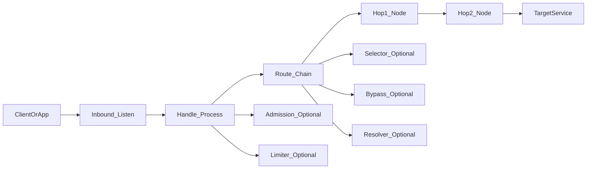
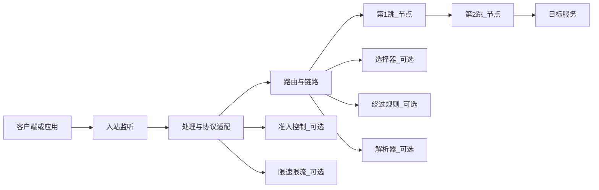

# GOST V3 入门系列（一）：概念

> 本篇定位：**只讲概念与术语**
> 版本声明：本文面向 **gost V3**。  

---

## 1. 用一句话把 gost 讲清楚

把 `gost` 想象成网络世界里的**转运中心**：

- 你把“包裹”（连接/流量）交给转运中心的**收货口**
- 转运中心按你给的规则做**分拣与改道**
- 最后把包裹交给**下一站**（上游节点/目标服务/另一段隧道出口……）

因此，`gost` 最核心的能力可以概括为：

- **接入（接住连接）**
- **处理（按规则处理/鉴权/选择路线）**
- **转交（把连接送到下一站并搬运数据）**

可以先把它理解成：一个高度可配置的“连接搬运工 / 流量中转框架”。

---

## 2. 把 3 个容易混淆的词讲明白

> 这些是通用网络概念，不依赖 gost 的实现细节

### 2.1 代理（Proxy）

你不直接和目标服务对话，而是让**代理**替你“转交请求、带回响应”。

- 对客户端：代理像“代办/中介”
- 对目标：代理像“来访者”

### 2.2 隧道（Tunnel）

更强调“把原本 A→B 的通信，装进一条 A→T→B 的通道里走一段”。

> 你要把一批车从乡间小路送到城市中心，但中间先“装进高速/地铁”跑一段，再“放出来继续走”。

### 2.3 转发/中继（Forward/Relay）

更强调：我收到连接后，**尽量不关心上层语义**，把字节流原样搬到下一站。

> 流水线上的“传送带”，只负责把货从 A 端搬到 B 端。

---

## 3. 把 gost 看成一条“可组装的流水线”

学习 gost 最容易走弯路的方式是：上来就背命令、背参数。  
更稳的方式是：先在脑中固定一条流水线，然后把所有配置/命令都映射到流水线的某一段。

一条典型的数据流（从客户端到目标）可以抽象为：

1. **入站（Inbound）**：在哪接住连接
2. **处理（Handling）**：如何处理入站连接（协议处理/鉴权/规则匹配等）
3. **出站（Outbound）**：往哪送、怎么送（直连或经由上游节点）
4. **链路编排（Chaining）**：出站路径是 0/1/多跳

用图固定下来（把它当成阅读所有文档/配置时的“总地图”）：

中文标注版（结构完全一致）：

后面看到任何名词（Service/Listener/Handler/Chain/Node/Hop/…），都可以问自己一个问题：

> **它是在“接入、处理、出站、编排”中的哪一段？**

---

## 4. 把文档术语翻译成人话（先记“位置感”，再记定义）

> 术语的精确定义可能因版本/实现略有差异；这里给的是直觉解释。在落地配置时，应对照 V3 官方文档/仓库的定义进行确认。

### 4.1 Service：一条可运行的“服务流水线”

一个 `Service` 是一套“入站 + 处理 + 出站/链路”的组合，能长期运行并接活。
> 一条快递线路（收货点 + 分拣规则 + 发车路线）。

### 4.2 Listener：入站的“收货口”

负责监听地址/端口，接收新连接。
> 快递站的收货窗口。或者门口保安，有人进小区只需要开门，后续怎么走去小区哪栋楼保安不管。

### 4.3 Handler：入站连接的“分拣员/翻译官”

对入站连接做必要处理，例如：识别请求、执行鉴权、根据规则决定下一跳怎么走。
> 分拣员检查包裹、贴转运单、决定走哪条线路。

> 记住：`Handler` 更像“入站处理逻辑”，不是“目的地本身”。

### 4.4 Chain：出站路径的“路线图”

连接出去时要走的路径定义，可以是直连，也可以是多跳。
> 直达/中转线路规划。

### 4.5 Hop / Node：链路上的“中转站（以及中转站的配置）”

先记直觉：

- **Hop（跳）**：路径上的第 N 站（第 1 跳、第 2 跳……）
- **Node（节点）**：这一跳“怎么连、连到哪、用什么方式连”的配置集合

> - Hop：第 N 个中转站
> - Node：这个中转站的“站内指引 + 班次信息 + 出站方式”

### 4.6 Dial/Connect/Forward（出站三连）：连上去 → 接通道 → 搬数据

不同版本/实现里这几者的边界可能不同；为了不写错细节，本篇只给**稳定的直觉**：

- **建立连接**：把去往下一站的“路”打通
- **协商通道**：必要时做协商/握手，让两端对齐
- **转发搬运**：两端开始持续对拷字节流，直到连接结束

可以把它理解为：出站侧的“三步走”。

> 建立连接 = “电话打通”
> 协商通道 = “对暗号/确认沟通规则”
> 转发搬运 = “开始实时传话直到挂断”

### 4.7 常见“可选插件”（策略/控制类）

下面这些通常用于“让流水线更可控”，先知道它们大概负责什么：

- **Selector**：多出口/多节点时“选哪个”
- **Bypass**：哪些目标/网段/域名要绕过（不走某条链路，或走另一条）
- **Resolver / Hosts**：域名解析与映射策略（解析在哪里发生、是否按规则映射）
- **Admission**：准入/访问控制（允许谁接入、拒绝谁接入）
- **Limiter**：限速/限流（把吞吐控制在某个范围）

---

## 5. 一次连接在 gost 里的“旅程”（把术语串起来）

当你的应用把连接交给 gost 后，你可以用下面的顺序在脑中复盘（这是排障和写配置的基础）：

1. **Listener**：接住连接（有人来敲门）
2. **Handler**：处理连接（你是谁、你要去哪、要不要认证、套用哪些规则）
3. **Chain**：决定路线（直连还是走多跳；是否按 Bypass/Selector 改道）
4. **出站建立**：把去往下一站（或目标）的通道打通
5. **转发搬运**：两边开始像“管道”一样双向搬运字节流，直到断开

稳定复述这 5 步，后面看任何 V3 的配置/示例，都能快速定位：

- “这个字段/参数是在配置第几步？”
- “出问题了，应该从哪一步的日志/网络现象开始查？”

---

## 6. 常见的 4 个误区

### 误区 1：把 gost 当成“某一个固定协议的代理软件”

更可靠的理解是：它是一套**可组合的转发/代理/隧道框架**。协议只是它“接入或出站方式”的一种实现。

### 误区 2：觉得多跳一定更安全/更快

多跳意味着更多复杂度：更高延迟、更多故障点、更难排障。它是工具，不是默认答案。

### 误区 3：只背参数，不画数据流

真正需要掌握的是：每个参数/配置对应流水线的哪一段（入站/处理/出站/编排/插件）。

### 误区 4：把“隧道”直接等同于“VPN”

两者可能都能“让流量绕一段路”，但工作层级、接入方式、行为特征不一定相同。除非你确认了具体实现与网络栈接入方式，否则不要画等号。

---

## 7. 小结（你需要记住的 3 句话）

1. **gost = 网络转运中心**：接入 → 处理 → 出站 →（可选）多跳编排  
2. **所有配置都能映射到流水线某一段**：定位清楚就不容易写乱  
3. **不确定就回到 V3 官方文档/仓库查证**：这是最快、最不容易踩坑的学习方式