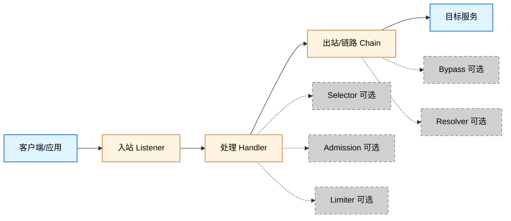
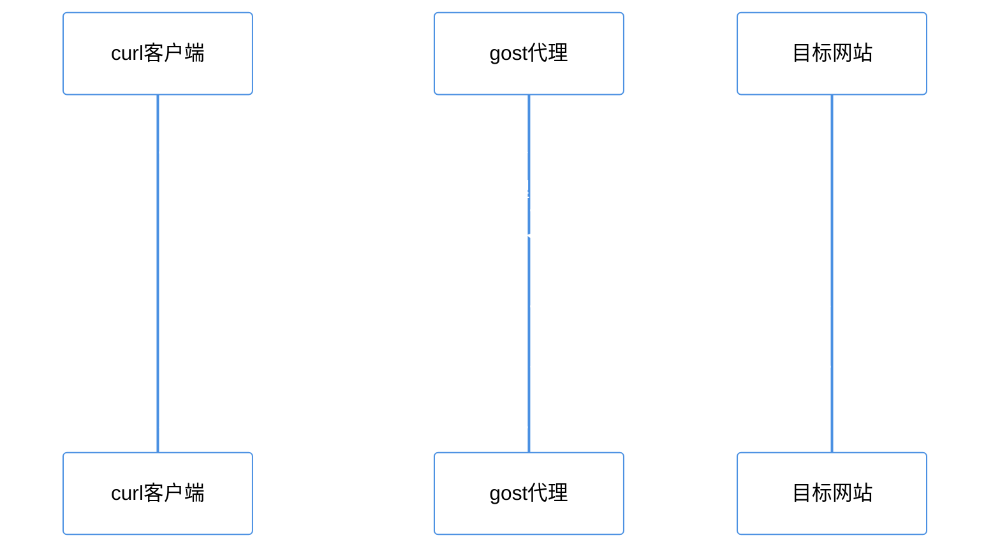

# GOST 入门指南（上）：从零开始

---

## 一、gost 是什么？

`gost` 是一个用 Go 语言编写的安全隧道工具。

### 1.1 用一句话理解 gost

把 `gost` 想象成网络世界里的**转运中心**：

- 你把"包裹"（连接/流量）交给转运中心的**收货口**
- 转运中心按你给的规则做**分拣与改道**
- 最后把包裹交给**下一站**（上游节点/目标服务）

因此，`gost` 最核心的能力可以概括为：

- **接入（接住连接）**
- **处理（按规则处理/鉴权/选择路线）**
- **转交（把连接送到下一站并搬运数据）**

### 1.2 基本概念

#### 代理（Proxy）

你不直接和目标服务对话，而是让**代理**替你"转交请求、带回响应"。

- 对客户端：代理像"代办/中介"
- 对目标：代理像"来访者"

#### 隧道（Tunnel）

更强调"把原本 A→B 的通信，装进一条 A→T→B 的通道里走一段"。

> 就像你要把一批车从乡间小路送到城市中心，但中间先"装进高速/地铁"跑一段，再"放出来继续走"。

#### 转发/中继（Forward/Relay）

更强调：我收到连接后，**尽量不关心上层语义**，把字节流原样搬到下一站。

> 就像流水线上的"传送带"，只负责把货从 A 端搬到 B 端。

---

## 二、gost 的架构

gost 的架构可以理解成一条"可组装的流水线"：



数据流向：

```
客户端 → 入站（Listener）→ 处理（Handler）→ 出站/链路（Chain）→ 目标服务
```

### 2.1 核心组件

#### Listener（监听器）

负责监听地址/端口，接收新连接。就像快递站的收货窗口。

#### Handler（处理器）

对入站连接做必要处理，例如：识别请求、执行鉴权、根据规则决定下一跳怎么走。就像分拣员检查包裹、贴转运单、决定走哪条线路。

#### Chain（链路）

连接出去时要走的路径定义，可以是直连，也可以是多跳。就像直达/中转线路规划。

#### Node（节点）

链路上的一个节点，表示"怎么连、连到哪、用什么方式连"的配置集合。

#### Hop（跳）

路径上的第 N 站（第 1 跳、第 2 跳……）。

### 2.2 可选组件

根据官方文档，gost 还支持以下可选组件：

- **Selector**：多出口/多节点时"选哪个"
- **Bypass**：哪些目标/网段/域名要绕过（不走某条链路）
- **Resolver**：域名解析策略
- **Admission**：准入/访问控制（允许谁接入、拒绝谁接入）
- **Limiter**：限速/限流

---

## 三、安装 gost

### 3.1 获取 gost V3

gost V3 的官方仓库是 `go-gost/gost`，建议只从它的 Release 下载二进制：

- 仓库：`https://github.com/go-gost/gost`
- Releases：`https://github.com/go-gost/gost/releases`

### 3.2 选择正确的文件

在 Releases 页面你会看到很多资产（Assets），名字通常会包含：

- **操作系统**：`windows` / `linux` / `darwin`（macOS）
- **架构**：`amd64`（最常见的 64 位 x86）、`arm64`（常见于 ARM 服务器/Apple 芯片）等

如果你不确定自己的架构：

- Windows：任务管理器 → 性能 → CPU（通常是 x64）
- Linux：`uname -m`
- macOS：Apple 芯片通常是 arm64，Intel 是 amd64

### 3.3 Windows 安装步骤

1. 打开 Releases 页面，下载带有 `windows` 和你架构（通常 `amd64`）的压缩包
2. 解压到一个固定目录，例如：`C:\Tools\gost\`
3. 解压后，你应该能看到 `gost.exe`

打开 PowerShell 并进入目录：

```powershell
cd C:\Tools\gost\
```

验证 gost 能跑起来：

```powershell
.\gost.exe -V
```

如果 `-V` 不生效，再试：

```powershell
.\gost.exe --version
.\gost.exe -h
.\gost.exe --help
```

你看到版本号或帮助菜单，就说明安装成功。

### 3.4 Linux/macOS 安装步骤

1. 下载与你系统匹配的 Release 资产
2. 解压并安装到 PATH

示例流程（把文件名替换成你实际下载的那个）：

```bash
cd /tmp
# 下载并解压（根据实际格式选择）
# tar -xzf gost.tar.gz

chmod +x gost
sudo mv gost /usr/local/bin/gost

# 验证
gost -V || gost --version || gost -h
```

### 3.5（可选）把 gost 加入 PATH

Windows：

1. Windows 搜索"环境变量" → 打开"编辑系统环境变量"
2. "环境变量…" → 在"用户变量"或"系统变量"里找到 `Path`
3. 编辑 → 新建 → 填入 `C:\Tools\gost\`
4. 一路确定
5. **重新打开** PowerShell（旧窗口不会自动刷新 PATH）

验证：

```powershell
gost -V
```

---

## 四、第一个可运行的例子

### 4.1 启动一个 SOCKS5 代理

启动命令：

```bash
gost -L socks5://127.0.0.1:1080
```

说明：
- `-L` 表示监听（Listen）
- `socks5://` 表示使用 SOCKS5 协议
- `127.0.0.1:1080` 表示监听在本机的 1080 端口

看到 gost 持续运行、没有立刻退出/报错，就表示监听已启动。

> 停止：在当前窗口按 `Ctrl + C`。

### 4.2 验证代理是否工作

数据流示意：



**第一步：确认端口在监听**

Windows（另外打开一个 PowerShell）：

```powershell
netstat -ano | findstr :1080
```

Linux/macOS：

```bash
ss -lntp | grep 1080 || netstat -an | grep 1080
```

你只需要看到类似"LISTEN/监听中"的信息即可。

**第二步：用 curl 测试**

用 `curl` 走 SOCKS5 代理访问测试站点：

```bash
curl.exe --socks5-hostname 127.0.0.1:1080 http://example.com -v
```

你能拿到响应内容/状态码（例如 `200` 或 `301`），就说明代理工作正常。

### 4.3（可选）启动 HTTP 代理

启动 HTTP 代理：

```bash
gost -L http://127.0.0.1:8080
```

用 curl 验证：

```bash
curl.exe -x http://127.0.0.1:8080 http://example.com -v
```

---

## 五、常见问题

### 5.1 端口被占用

如果提示"address already in use"，说明端口被占用了。解决方法是换一个端口：

```bash
gost -L socks5://127.0.0.1:1081
```

### 5.2 Windows 里运行提示"无法运行/被阻止"

可能是：
- 文件来自网络下载，被 Windows 标记为不安全（右键属性里解除阻止）
- 杀软拦截（需要按公司安全策略处理）

### 5.3 curl 找不到命令

- Windows 10/11 一般自带 `curl`
- Linux：安装 `curl`（如 `apt install curl`）

### 5.4 curl 能连到 127.0.0.1:1080，但访问目标失败

这类问题通常不在 Listener，而在"出站/网络环境/目标可达性"。你可以：

- 先不用代理直接 `curl http://example.com -v` 看本机是否能访问
- 再用代理访问
- 看 gost 是否打印错误日志

---

## 六、小结
1. 理解 gost 是什么，以及它的核心能力
2. 理解 gost 的架构（Listener、Handler、Chain、Node、Hop）
3. 从官方 Release 下载并安装 gost
4. 启动一个本机的 SOCKS5 或 HTTP 代理
5. 用 `curl` 验证代理是否工作